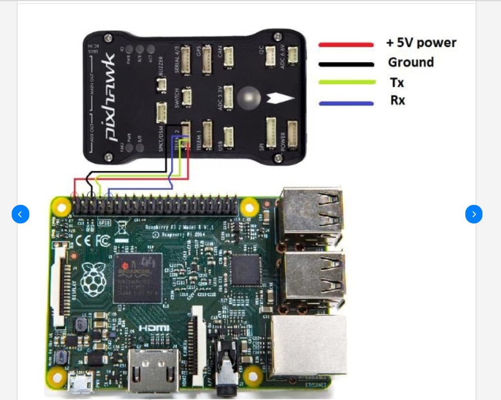

# Drone-G-Station

A Ground Station software for controlling drones using a Raspberry Pi 3, Pixhawk 2.4.8, and MAVLink protocol. This software facilitates communication between the ground station and the drone for operations like Auto Mode, Patrol Mode, and manual control.


### Features

- Communicates with Pixhawk 2.4.8 via MAVLink
- Uses Raspberry Pi 3+ for onboard processing
- Secure SSH-based connection to the Raspberry Pi
- Live telemetry and mission planning

### Prerequisites
Before running the project, ensure you have the following:
Raspberry Pi 3B+ (or later)
Pixhawk 2.4.8 flight controller

### Connection between RaspberryPi and Pixhawk


### Required Modules on Raspberrypi
```
sudo apt update
sudo apt install -y libcamera-apps gstreamer1.0-tools gstreamer1.0-plugins-{base,good,bad,ugly} gstreamer1.0-libav
```

### Follow these steps to set up and run the project:

1. Clone the Repository
```
git clone https://github.com/VedantS73/drone_g_station.git
cd drone_g_station
```

2. Install Dependencies
```
pip install -r requirements.txt
```

3. Run the station
```
python ground_station.py
```

### Manual Startup
##### Start MAVProxy
```
mavproxy.py --master=/dev/ttyAMA0 --out=tcpin:0.0.0.0:5760
```
##### Stream Video over GStreamer
```
libcamera-vid -t 0 --width 1280 --height 720 --framerate 30 -o - | gst-launch-1.0 -v fdsrc ! h264parse ! rtph264pay config-interval=1 pt=96 ! udpsink host=192.168.0.108 port=5005
```

##### To recieve stream manually
```
gst-launch-1.0 -v udpsrc port=5005 caps="application/x-rtp, encoding-name=H264, payload=96" ! rtph264depay ! avdec_h264 ! videoconvert ! autovideosink
```